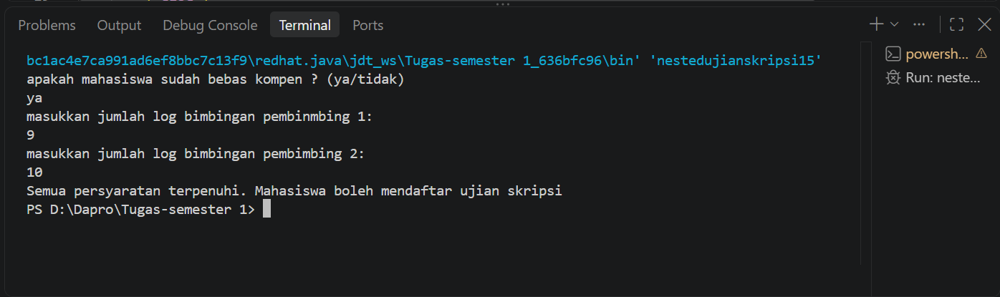
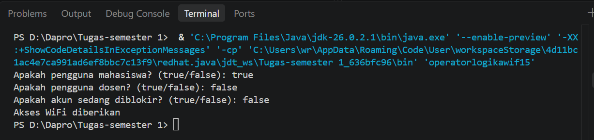
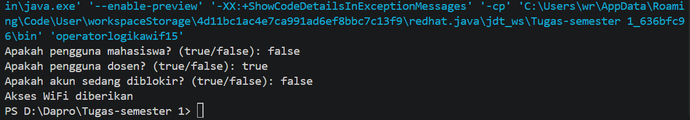
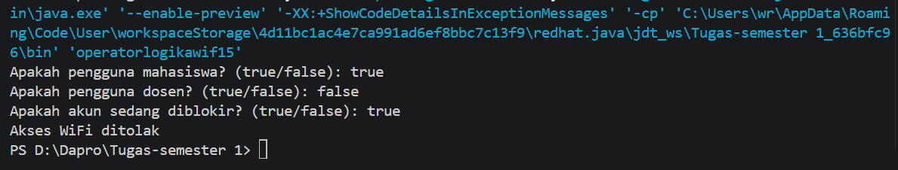
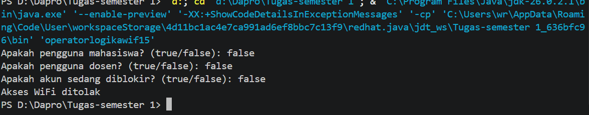
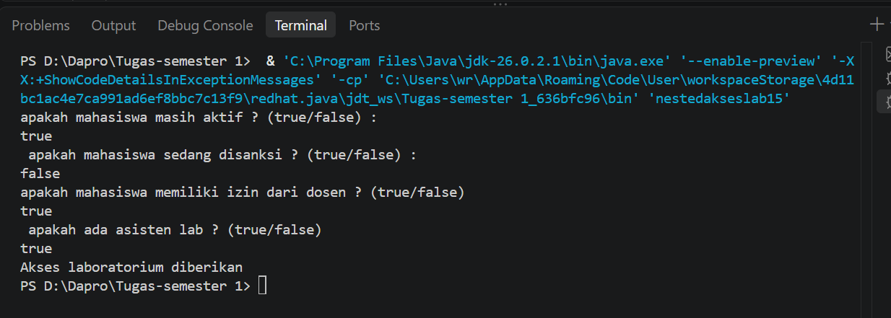

# JOBSHEET 5 - PEMILIHAN 2

**Identitas Mahasiswa:**
* **Nama:** Fahri Raihan Baldan
* **NIM:** 264107020067
* **Kelas / No. Presensi:**  1D/15

---

## 1: TUJUAN PRAKTIKUM

Berikut adalah tujuan pelaksanaan praktikum pada bab ini:

1. Mahasiswa mampu menyelesaikan permasalahan/studi kasus menggunakan sintaks pemilihan bersarang
2. Mahasiswa mampu menerapkan sintaks pemilihan bersarang ke dalam program Jawa
3. Mahasiswa mampu menerapkan operator logika &&, ||, dan ! pada struktur pemilihan

---

## 2: HASIL PERCOBAAN & ANALISIS

### 2.1 Percobaan 1: Nested IF untuk Mengecek Syarat Ujian Skripsi

Seorang mahasiswa akan mendaftar ujian skripsi. Sistem SIMTA akan memeriksa syarat administrasi terlebih dahulu, yaitu mahasiswa harus bebas kompen. Jika syarat ini terpenuhi, sistem kemudian memeriksa catatan log bimbingan. Untuk bisa mendaftar ujian, mahasiswa harus memiliki minimal 8 kali bimbingan dengan pembimbing 1 dan minimal 4 kali bimbingan dengan pembimbing 2. Jika semua syarat terpenuhi, mahasiswa dapat melanjutkan ke proses pendaftaran ujian skripsi. Jika tidak, sistem akan menampilkan alasan kegagalan. Berdasarkan kasus tersebut, program Java dibuat dengan langkah-langkah berikut.

#### 2.1.1 Kode Program Java
```java
import java.util.Scanner;
public class nestedujianskripsi15 {
    public static void main(String[] args) {
        Scanner sc = new Scanner (System.in);
        String pesan;
        System.out.println("apakah mahasiswa sudah bebas kompen ? (ya/tidak)");
        String Bebaskompen = sc.nextLine().trim();
        System.out.println("masukkan jumlah log bimbingan pembinmbing 1:");
        int bimbingan1 = sc.nextInt();
        System.out.println("masukkan jumlah log bimbingan pembimbing 2:");
        int bimbingan2 = sc.nextInt();
        if (Bebaskompen.equalsIgnoreCase("ya")) {
        if (bimbingan1 >= 8 && bimbingan2>= 4) {
        pesan = "Semua persyaratan terpenuhi. Mahasiswa boleh mendaftar ujian skripsi";
        } else if (bimbingan1 < 8 && bimbingan2 < 4) {
        pesan = "gagal ! log pembimbingan p1 kurang dari 8 kali dan log pembimbingan p2 kurang dari 4 kali";
         } else if (bimbingan1 < 8) {
         pesan = "gagal! log pembimbingan p1 belum mencapai 8 kali";
        } else {
        pesan = "gagal! log pembimbingan p2 belum mencapai 4 kali";
        }
        } else {
         pesan = "gagal, mahasiswa masih memiliki tanggungan kompen";
        }
        System.out.println(pesan);
        sc.close();
    }
}
```

#### 2.1.2 Hasil Running / Screenshot Output
Berikut adalah contoh tampilan *output* setelah program dijalankan:



#### 2.1.3 Jawaban Pertanyaan / Pertanyaan Refleksi
* **Pertanyaan 1:** Apa yang terjadi jika mahasiswa menjawab "No" pada pertanyaan bebas kompen? Mengapa demikian?
  * **Jawab:** maka hasil output akan menjadi false, karena mahasiswa masih memilii kompen, dan alur codingan memang mengarahkanke arah false jika tidak memilih Ya.
* **Pertanyaan 2:** Jelaskan maksud dari potongan kode berikut! 
    ```java
    if (bimbinganP1 >= 8 && bimbinganP2>= 4)
ab:** yang dimaksud dari potongan kode tersebut adalah jika bimbingan P1 lebih dari sama dengan 8 dan bimbinganP2 lebih dari samadengan 4, maka bersifat tru dan menjalankan kode didalam kode IF

* **Pertanyaan 3:** Bagaimana alur pemeriksaan syarat mahasiswa dari awal sampai akhir? Jelaskan secara runtut untuk semua kondisi!
  * **Jawab:** jadi mahasiswa di seleksi dari apakah mahsiswa memiliki kompen, setelah itu berapa banyak bimbingan P1 dan bimbingan P2, apakah bimbingan P1 lebih dari sama dengan 8 kali dan bimbingan P2 lebih dari sama dengan 4 kali maka diperbolehkan mengikuti ujian, tetapi jika tidak maka akan ditanya yang mana yang kurang, jika bimbingan P1 kurang 8 maka tidak diperbolehkan, jika tidak kurang , maka bimbingan P2 yang kurang, karen untuk mencapai seleksi ini, pasti diantara salah satu nya yang kurang    ```
* **Jaw


---

### 2.2 PPercobaan 2: Operator Logika untuk Menentukan Akses WiFi Kampus

Sistem WiFi kampus hanya dapat digunakan oleh mahasiswa atau dosen yang akunnya tidak diblokir. Program menerima informasi apakah pengguna merupakan mahasiswa, dosen, dan apakah akun pengguna sedang diblokir. Akses diberikan apabila pengguna merupakan mahasiswa atau dosen, dan akun pengguna tidak diblokir. Percobaan ini digunakan untuk mempraktikkan operator logika && (AND), || (OR), dan ! (NOT).

#### 2.2.1 Kode Program Java
```java
import java.util.Scanner;

public class operatorlogikawif15 {

    public static void main(String[] args) {
        Scanner sc = new Scanner (System.in);
        boolean mahasiswa;
        boolean dosen;
        boolean akunDiblokir;
        System.out.print("Apakah pengguna mahasiswa? (true/false): ");
        mahasiswa = sc.nextBoolean();
        System.out.print("Apakah pengguna dosen? (true/false): ");
        dosen = sc.nextBoolean();
        System.out.print("Apakah akun sedang diblokir? (true/false): ");
        akunDiblokir = sc.nextBoolean();
        if ((mahasiswa || dosen) && !akunDiblokir) {
        System.out.println("Akses WiFi diberikan");
        } else {
         System.out.println("Akses WiFi ditolak");
        }
        sc.close();
    }
}
```


#### 2.2.2 tabel output dan hasil screenshot nya

menguji output yang ada:

| uji | Mahasiswa | Dosen | akunDiblokir |
| :---: | :--- | :--- | :---: |
| 1 | true | false | false |
| 2 | false | treu | false |
| 3 | true| false | true |
| 3 | false | false | false |

**screnshot**





#### 2.2.3 pertanyaan

* **Pertanyaan 1:** Jelaskan fungsi operator ||, &&, dan ! pada kondisi program tersebut ?
  * **Jawab:** fungsi || digunakan untuk operator atau, memilih diatara dua variabelyang ada, fungsi && adalahn operator dan, mengharus kan dua variabel untuk benar jika ingin output true. dan fungsi ! digunakan untuk menegasikan sebuah bilangan.
* **Pertanyaan 2:** Mengapa pengguna dosen tetap dapat memperoleh akses ketika nilai mahasiswa = false?
  * **Jawab:** karena dosen memiliki privillage, dimana di dalam code, pengguna dosen langsung di berikan akses tanpa memberitahu nilai lain nya
* **Pertanyaan 3:** Ubah operator || menjadi &&. Jalankan kembali program menggunakan data uji 1 dan 2. Apa yang terjadi dan mengapa?
  * **Jawab:** jika operator || menjadi && , maka hasil nya menjadi false semua, karena kedua varibel harus lah true agar hasil output menjadi true.
* **Pertanyaan 4:** Pada ekspresi mahasiswa || dosen, kapan kondisi dosen tidak perlu dievaluasi? Jelaskan berdasarkan short-circuit evaluation.
  * **Jawab:** jika variabel mahasiswa bernilai true.
* **Pertanyaan 5:** Pada ekspresi (mahasiswa || dosen) && !akunDiblokir, kapan kondisi !akunDiblokir tidak perlu dievaluasi? Jelaskan.
  * **Jawab:** jika nilai (mahasiswa || dosen) bernilai false
  

---
### 2.3 Percobaan 3: Nested IF dan Operator Logika untuk Menentukan Akses Laboratorium

Mahasiswa dapat menggunakan laboratorium di luar jadwal kuliah apabila statusnya aktif dan tidak sedang mendapatkan sanksi. Jika syarat tersebut terpenuhi, sistem melakukan pemeriksaan kedua. Akses laboratorium diberikan apabila mahasiswa memiliki izin dosen atau merupakan asisten laboratorium. Kasus ini menggabungkan pemilihan bersarang dengan operator logika.

#### 2.3.1 Kode Program Java
```java
import java.util.Scanner;
public class nestedakseslab15 {
    public static void main(String[] args) {
        Scanner sc = new Scanner (System.in);
        System.out.println("apakah mahasiswa masih aktif ? (true/false) :");
        boolean mahasiswaAktif = sc.nextBoolean();
        System.out.println( " apakah mahasiswa sedang disanksi ? (true/false) : ");
        boolean sedangDisanksi = sc.nextBoolean();
        System.out.println("apakah mahasiswa memiliki izin dari dosen ? (true/false)");
        boolean punyaIzinDosen = sc.nextBoolean();
        System.out.println(" apakah ada asisten lab ? (true/false)");
        boolean asistenLab = sc.nextBoolean();

       
        if (mahasiswaAktif && !sedangDisanksi) {
         if (punyaIzinDosen || asistenLab) {
        System.out.println("Akses laboratorium diberikan");
        } else {
        System.out.println("Akses ditolak: membutuhkan izin dosen atau status asisten lab");
        }
        } else {
        System.out.println("Akses ditolak: status mahasiswa tidak memenuhi syarat");
        }
        sc.close();
    }
    
}
```

#### 2.3.2 Hasil Running / Screenshot Output
Berikut adalah contoh tampilan *output* setelah program dijalankan:




#### 2.3.3 Jawaban Pertanyaan / Pertanyaan Refleksi
* **Pertanyaan 1:** Mengapa pemeriksaan punyaIzinDosen || asistenLab ditempatkan di dalam IF pertama?
  * **Jawab:** karena pemeriksaan ini bisa memilih apakah di sana ada asisten lab yang membantu atau sudah mendapatkan izin dosen untuk langsung masuk ke lab
* **Pertanyaan 2:** Jelaskan fungsi operator &&, ||, dan ! pada program tersebut.
  * **Jawab:** && untuk menentukan apakah mahasiswa tidak disanksi dan mahasiswa yang aktif, || untuk menentukan izn dosen atau asisten lab yang menentukan izin lab, dan ! untuk menyatakan bahwa hasil dari sedang disanksi bernilai berlawanan dari input nya.
* **Pertanyaan 3:** Apakah syarat akses dapat ditulis menjadi satu kondisi: mahasiswaAktif && !sedangDisanksi && (punyaIzinDosen || asistenLab)? Jelaskan apakah keputusan akses akhirnya sama.
  * **Jawab:** bisa digabung, dan hasil keputusan akses nya akan tetap sama karena alur kode nya yang sama, dimana di kode if nested, diperlihatkan bahwa kita harus di cek mahasiswa adalah mahasiswa aktif dan memiliki sanksi serta memiliki izn atau ada asisten lab. yang berbeda adalah pengeluaran atau outputnya, dimana pilihan output akan menjadi lebih sedikit.
* **Pertanyaan 4:** Apa keuntungan menggunakan Nested IF pada kasus ini dibandingkan hanya satu IF jika sistem perlu menampilkan alasan penolakan yang berbeda?
  * **Jawab:** keuntungan nya ialah kita bisa menampilkan keluaran yang berbeda dengan hasil input yang berbeda, serta kode tidak perlu menjalankan kode yang tidak perlu jika hasil awal sudah salah.
* **Pertanyaan 5:** Buat satu kombinasi masukan yang menyebabkan akses ditolak pada level pertama dan satu kombinasi yang menyebabkan akses ditolak pada level kedua.
  * **Jawab:** kombinasi satu ialah ( true true true true), dimana akan otomatis ditolak di level pertama dan kombinasi kedua ialaha ( True false false false), dimana akan ditolak di level kedua.
  ---

## 3: TUGAS MANDIRI

Berikut adalah daftar tugas yang dikerjakan pada Jobsheet ini:

- [x] **Tugas 1:** Implementasikan flowchart yang telah Anda buat pada Latihan 2 Pertemuan 6 terkait sistem diskon toko buku ke dalam program Java. Program wajib menerapkan struktur pemilihan bersarang (Nested IF). Gunakan operator logika apabila diperlukan.

- [x] **Tugas 2:** Buatlah program Java untuk sistem seleksi calon asisten praktikum berdasarkan ketentuan berikut:
1. Mahasiswa dapat mengikuti seleksi apabila berstatus aktif dan tidak sedang mendapatkan sanksi akademik.
2. Jika syarat tersebut terpenuhi, mahasiswa harus memenuhi syarat berikutnya yaitu nilai Dasar Pemrograman minimal 80 atau memiliki sertifikat kompetensi pemrograman.
3. Jika lolos 2 syarat tersebut, mahasiswa akan dipanggil untuk mengikuti wawancara. Mahasiswa diterima sebagai asisten apabila nilai wawancara minimal 75.
4. Program harus menampilkan alasan apabila mahasiswa gagal pada setiap tahap seleksi.
5. Gunakan pemilihan bersarang dan operator logika. Simpan file dengan nama tugas2SeleksiAsistenNoPresensi.java.


### 3.1 Implementasi Kode Tugas
**Tugas 1:**
```java
import java.util.Scanner;
public class diskontokobuku15 {
    public static void main(String[] args) {
        Scanner sc = new Scanner (System.in);
        System.out.println("apakah hari ini hari rabu ? (true /false): ");
        boolean hari = sc.nextBoolean();
        System.out.println("apakah membeli buku novel ?");
        boolean novel = sc.nextBoolean();
        System.out.println("apakah membeli buku kamus ");
        boolean kamus = sc.nextBoolean();
        System.out.println(" apakah membeli selain buku kamus dan novel");
        boolean selain = sc.nextBoolean();
        System.out.println(" berapa beli buku novel (jika tidak membeli beri angka 0)");
        int jmlnovel = sc.nextInt();
        System.out.println(" berapa beli buku kamus (jika tidak membeli beri angka 0)");
        int jmlkamus = sc.nextInt();
        System.out.println(" berapa beli buku selainnya (jika tidak membeli beri angka 0)");
        int jmlselain = sc.nextInt();

        System.out.println(" kalau beli kamus elu bisa dapat diskon");
        if ( hari ){
            if ( kamus ){
                if (jmlkamus < 2 && jmlkamus > 0){
                        System.out.println("diskon 10% bang");
                } else if (jmlkamus > 2){
                    System.out.println(" diskon dapat 10% plus 2%");
                }else {
                    System.out.println( " enggak beli kamus ya ");
                }
            } else {
                System.out.println( " beli novel aja berarti ");
            }
        }else {
            System.out.println("bukan hari rabu, enggak ada diskon bro !" );
        }
        System.out.println("kalau beli novel dapat diskon cuy");
        if ( hari ){
            if ( novel ){
                if (jmlnovel < 3 && jmlnovel > 0){
                        System.out.println("diskon 7% bang");
                        System.out.println("dan kayak ya dapet diskon 1% ");
                } else if (jmlnovel > 3){
                    System.out.println(" diskon dapat 7% plus 2%");
                }else {
                    System.out.println( " enggak beli novel ya ");
                }
            } else {
                System.out.println( " beli kamus aja berarti ");
            }
        }else {
            System.out.println("dah di bilangin enggak ada diskon !" );
        }
        System.out.println(" kalau beli buku lain tetep dapet diskon kok");
        if ( hari ){
            if ( selain ){
                if (jmlselain > 3 ){
                    System.out.println(" diskon dapat 5% doang mas");
                    }else if  (jmlselain < 3 &&  jmlselain > 0){
                    System.out.println("beli banyak lagi, biar dapat diskon");
                 }else {
                    System.out.println( " ngapain bilang iya, kamu enggak beli buku lain gitu ");
                }
            } else {
                System.out.println( " udah beli buku kan elu ");
            }
        }else {
            System.out.println("besok besok aja beli buku !" );
        }
        
        if (jmlkamus == 0 && jmlnovel == 0 && jmlselain == 0){
            System.out.println( " katanya beli, kok enggak beli apa apa cuy! ");
        } else if ( novel && kamus && selain) {
            System.out.println( " anjay borong kah ");
        } else if (!novel && !kamus && !selain ){
            System.out.println("lihat lihat aja kah");
        }
        sc.close();
    }
}

```
**Tugas 2:**
```java
import java.util.Scanner;
public class calonasisten15 {
    public static void main(String[] args) {
        Scanner sc = new Scanner (System.in);
        System.out.println("apakah mahasiswa aktif (true/false)?");
        boolean status = sc.nextBoolean();
        System.out.println(" apakah siswa memiliki kompen (true/false)?");
        boolean kompen = sc.nextBoolean();
        System.out.println("berapa nilai dasar pemograman mahasiswa (1-100)?");
        int nilai = sc.nextInt();
        System.out.println(" apakah siswa memiliki sertifikat kompetensi pemograman ?");
        boolean sertif = sc.nextBoolean();
        System.out.println(" berapa nilai wawancara mahasiswa (1-100)? ");
        int wawancara = sc.nextInt();

        if (status && !kompen) {
            if (nilai > 80 || sertif){
                if ( wawancara > 75){
                    System.out.println(" selamaat anda di terima sebagai asisten");
                }else {
                    System.out.println("maaf nilai wawancara tidak memadai");
                }
            } else {
                System.out.println(" Nilai kurang memadai atau tidak memiliki sertifikat");
            }
        } else {
            System.out.println("Bukan mahasiswa aktif");
        }
        sc.close();
    }
}
```
---

## 4: KESIMPULAN

Nested IF adalah kode program yang penting dalam pemilihan lanjutan, dimana kita bisa mengatur bagaimana jalan nya program, apakah setelah menentukan jumlah, maka perlu kearah mana, serta efifsensi input dengan memasukkan input kedalam code if.